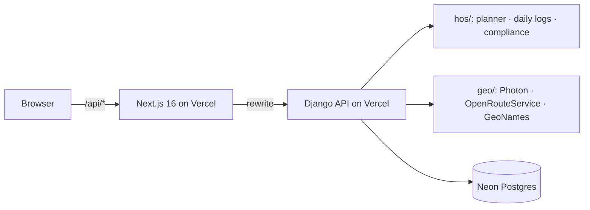

# Milepost: ELD Trip Planner

[](https://github.com/Dweirii/eld-trip-planner/actions/workflows/ci.yml)

**Plan a truck trip under FMCSA Hours-of-Service rules. You get the route, every required stop, and filled-in Driver's Daily Log sheets.**

**Live app:** https://milepost-eld.vercel.app · **API docs:** https://milepost-api.vercel.app/api/docs/


## What it does

You enter four things:
- the current location;
- the pickup;
- the dropoff;
- the hours already used in the 70-hour / 8-day cycle.

Milepost then works in four steps:

1. **Routes a truck.** It uses the OpenRouteService heavy-goods-vehicle profile.
2. **Simulates the trip under 49 CFR Part 395:**
   - 11 h of driving within a 14 h window;
   - a 30-minute break after 8 h of driving;
   - 10 h rests;
   - the 70 h / 8-day limit, with a 34-hour restart;
   - fuel at least every 1,000 miles;
   - 1 h each for pickup and dropoff.
3. **Re-checks the plan with an independent compliance checker.**
4. **Draws one paper-style daily log per day.** Each log has:
   - the duty-status grid;
   - totals that add up to 24;
   - remarks at every change of duty status;
   - the 70-hour recap.

   The logs are ready to print as one landscape page per day.

Try the example chips:
- *Short haul*;
- *Multi-day*;
- *Cross-country*, which adds fuel stops;
- *Restart needed*, which forces a 34-hour restart.

You can select any stop on the map, in the itinerary, or on a log sheet's remark bracket, and it is highlighted in all three places.


On phones, the planner becomes a bottom sheet over the map:


## Architecture



| Folder | What it is |
|---|---|
| [`backend/`](backend/) | The Django 5.2 + DRF API, in three parts:<br>• `hos/` is a pure-Python HOS engine: rules with CFR citations, the planner, the log builder and an independent checker.<br>• `geo/` wraps geocoding, routing and the offline town index.<br>• `trips/` is the API itself. |
| [`frontend/`](frontend/) | Next.js 16 + React 19 + Tailwind 4: a map workspace (MapLibre), the itinerary, rule checks and paper-style SVG log sheets. See [`frontend/README.md`](frontend/README.md). |
| [`docs/design/`](docs/design/) | The design spec and UI mockups. |

## How each rule maps to code

| Rule | Where |
|---|---|
| 11 h driving, 14 h window, 30-min break, 10 h rest, 70 h / 8 days, 34 h restart, fuel ≤ 1,000 mi, 1 h pickup / dropoff | `backend/hos/rules.py` (`HOSRules`) → `planner.py` |
| Daily log grid, totals = 24 h, remarks, recap (A / B / C as on the paper template) | `backend/hos/daily_logs.py` → `frontend/features/log-sheets/` |
| Independent verification of every plan | `backend/hos/compliance.py` → the app's "Rules ✓" tab |

Some assumptions go beyond the rules themselves. For example, cycle hours don't roll off during the trip, and the home terminal keeps one fixed time zone. They are listed in `backend/hos/rules.py` and shown in the app's **Assumptions** tab.

## Run locally

```bash
# API (needs a free OpenRouteService key in backend/.env; see backend/.env.example)
cd backend && uv sync && uv run python manage.py migrate && uv run python manage.py runserver 8000

# Web app
cd frontend && pnpm install && cp .env.example .env.local && pnpm dev   # http://localhost:3000
```

## Tests

```bash
cd backend && uv run pytest        # unit, FMCSA-example, property-based (random trips) and API tests
cd frontend && pnpm test           # geometry, formatting, form model, components
cd frontend && pnpm test:e2e       # Playwright smoke test of the planning flow
```

CI runs all three on every push and pull request.

## Credits

- Map data © OpenStreetMap contributors.
- Tiles by OpenFreeMap.
- Routing by openrouteservice.org.
- Geocoding by Photon (komoot).
- Towns and time zones from GeoNames (CC BY 4.0).
