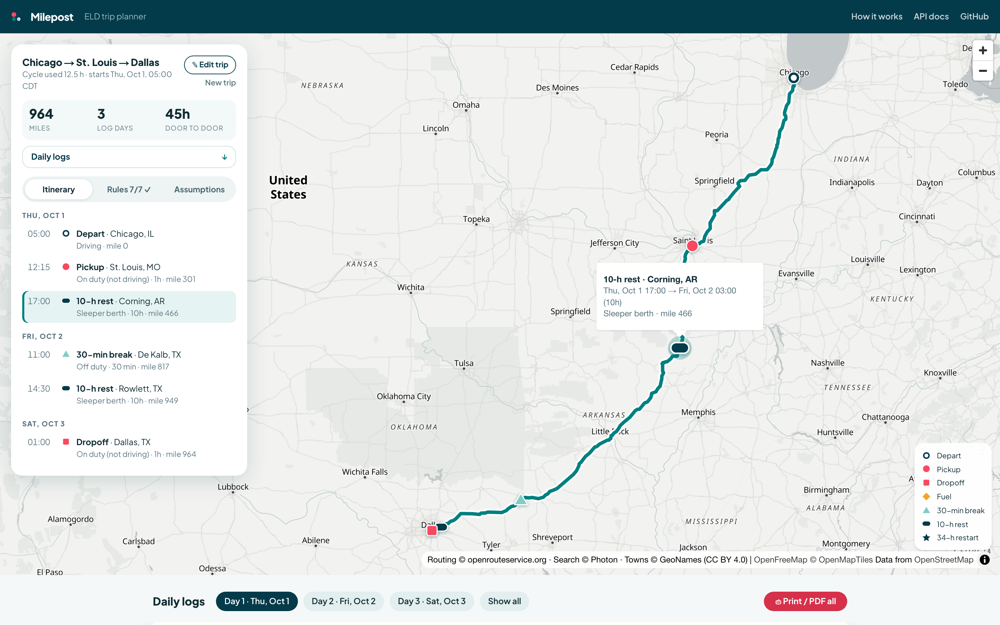
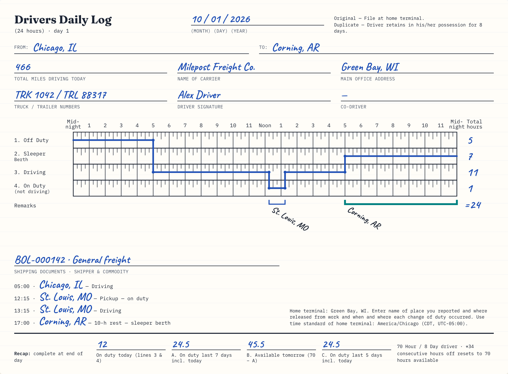
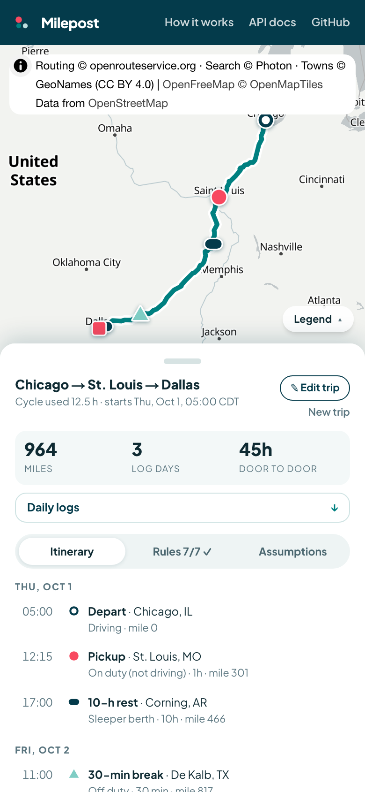
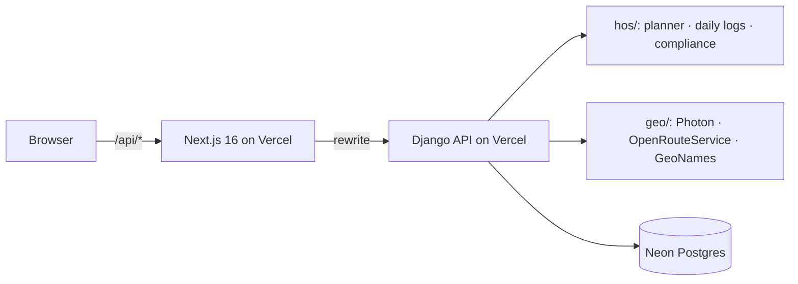

# Milepost: ELD Trip Planner

[](https://github.com/Dweirii/eld-trip-planner/actions/workflows/ci.yml)

**Plan a truck trip under FMCSA Hours-of-Service rules. You get the route, turn-by-turn directions, every required stop, and filled-in Driver's Daily Log sheets.**

**Live app:** https://milepost-eld.vercel.app · **Video walkthrough:** https://youtu.be/rJqVPO8-cGk · **API docs:** https://milepost-api.vercel.app/api/docs/

New here? Open the live app and click **Take the tour**: a narrated, two-minute walkthrough that plans a real trip and shows every feature.



## What it does

You enter four things:
- the current location;
- the pickup;
- the dropoff;
- the hours already used in the 70-hour / 8-day cycle.

Milepost then works in four steps:

1. **Routes a truck** with the OpenRouteService heavy-goods-vehicle profile. Turn-by-turn directions come back for each leg.
2. **Simulates the trip under 49 CFR Part 395:**
   - 11 h of driving within a 14 h window;
   - a 30-minute break after 8 h of driving;
   - 10 h rests;
   - the 70 h / 8-day limit, with a 34-hour restart;
   - fuel at least every 1,000 miles;
   - 1 h each for pickup and dropoff.
3. **Re-checks the plan with an independent compliance checker.** The checker is separate code from the planner, and every rule shows its observed value, its limit and its CFR citation.
4. **Draws one paper-style daily log per day.** Each log has:
   - the duty-status grid;
   - totals that add up to 24;
   - remarks at every change of duty status;
   - the 70-hour recap.

   The logs print as one landscape page per day.

Try the example chips:
- *Short haul*;
- *Multi-day*;
- *Cross-country*, which adds fuel stops;
- *Restart needed*, which forces a 34-hour restart.

You can select any stop on the map, in the itinerary, or on a log sheet's remark bracket, and it is highlighted in all three places. Every trip gets a shareable link (`/trips/<id>`).

**Play trip** replays the plan: a truck drives the route along a timeline you can scrub, while the itinerary and the log sheet's "now" line move with it.



On phones, the planner becomes a bottom sheet over the map:



## The brief, point by point

| Spotter's requirement | Where it is met |
|---|---|
| Inputs: current location, pickup, dropoff, current cycle used (hrs) | The trip form: autocomplete with "use my location", and a 0–70 h cycle gauge. The API validates every input. |
| Output: a map with the route and information about stops and rests, from a free map API | MapLibre with OpenFreeMap tiles and an OpenRouteService truck route. Each stop kind has its own marker shape, with popups (kind, place, time, mile) and a legend. |
| Output: route instructions | The **Directions** tab gives turn-by-turn instructions for each leg. The **Itinerary** tab lists every stop by day, with time, duration, duty status and mile. |
| Output: daily log sheets, drawn and filled out, several for longer trips | One SVG sheet per day, modelled on the FMCSA paper log. |
| Assumption: property-carrying driver, 70 h / 8 days, no adverse conditions | `HOSRules` in `backend/hos/rules.py` |
| Assumption: fuel at least once every 1,000 miles | The planner inserts 30-minute on-duty fuel stops, and the checker verifies the gaps. |
| Assumption: 1 hour for pickup and dropoff | Each is 1 h on duty (not driving), and the checker verifies both. |
| Hosted, with the code on GitHub | Vercel (two projects) with Neon Postgres. This repository. |

## How accuracy is verified

- **An independent checker.** `backend/hos/compliance.py` re-derives every limit from the planned duty events, without trusting the planner. Every trip the API returns carries its verdict; the app shows it as "Rules 7/7 ✓".
- **The FMCSA guide's own examples.** These are tests: the scenarios on pp. 6 and 7, and the rolling 8-day table on p. 11.
- **Property-based tests.** Hypothesis plans hundreds of random trips per run (any distances, any cycle hours) and requires zero violations.
- **The log sheets add up.** Each day totals exactly 24 h. Daily miles add up to the trip total. The recap's A / B / C lines follow the paper form.
- **The live API is tested.** It was checked against the real OpenRouteService and Photon for short, multi-day, cross-country and restart trips, plus free-text places such as "Port of Long Beach".

## Assumptions (also in the app's Assumptions tab)

- The driver starts with full 11-hour and 14-hour allowances, meaning at least 10 hours off before the trip.
- Cycle hours already used count toward 70 for the whole trip and never roll off. A 34-hour restart resets them.
- Any 30 consecutive minutes not driving satisfies the 30-minute break.
- Daily 10-hour rests are logged in the sleeper berth. Breaks and 34-hour restarts are logged off duty.
- Times use the home terminal's time zone (the current location's), at its UTC offset when the trip starts.
- Drive times come from the truck route and are rounded to the log's 15-minute grid.

## Architecture



| Folder | What it is |
|---|---|
| [`backend/`](backend/) | The Django 5.2 + DRF API, in three parts:<br>• `hos/` is a pure-Python HOS engine (no Django, no I/O): rules with CFR citations, the planner, the log builder and the independent checker.<br>• `geo/` wraps geocoding, truck routing, the offline town index and the caches.<br>• `trips/` is the API. |
| [`frontend/`](frontend/) | Next.js 16 + React 19 + Tailwind 4: a map workspace (MapLibre), the itinerary, directions, rule checks and paper-style SVG log sheets. See [`frontend/README.md`](frontend/README.md). |
| [`docs/design/`](docs/design/) | The design spec and UI mockups. |
| [`AGENTS.md`](AGENTS.md) | Commands, architecture rules and conventions for contributors. |

### API

| Endpoint | What it does |
|---|---|
| `POST /api/trips/` | Plans a trip. It returns the route (with per-leg directions), the stops, the daily logs, the compliance checks and the assumptions. |
| `GET /api/trips/{id}/` | Fetches a saved trip (the shareable link). |
| `GET /api/geocode/?q=` and `GET /api/geocode/reverse/?lat=&lng=` | Place search and reverse lookup (US). |
| `GET /api/health/` | Liveness check. |

Errors share one envelope: `{"error": {"code", "message", "field"?}}`. The full OpenAPI schema is at [`/api/docs/`](https://milepost-api.vercel.app/api/docs/).

```bash
curl -s https://milepost-api.vercel.app/api/trips/ -H 'Content-Type: application/json' -d '{
  "current_location": {"label": "Chicago, IL"},
  "pickup_location": {"label": "St. Louis, MO"},
  "dropoff_location": {"label": "Dallas, TX"},
  "current_cycle_used_hours": 12.5
}'
```

## Run locally

```bash
# API (needs a free OpenRouteService key in backend/.env; see backend/.env.example)
cd backend && uv sync && uv run python manage.py migrate && uv run python manage.py runserver 8000

# Web app
cd frontend && pnpm install && cp .env.example .env.local && pnpm dev   # http://localhost:3000
```

## Tests

```bash
cd backend && uv run pytest        # unit, FMCSA-example, property-based (random trips) and API tests
cd frontend && pnpm test           # geometry, formatting, form model, components
cd frontend && pnpm test:e2e       # Playwright smoke test of the planning flow
```

CI runs all three on every push and pull request.

## Credits

- Map data © OpenStreetMap contributors.
- Tiles by OpenFreeMap.
- Routing and directions by openrouteservice.org.
- Geocoding by Photon (komoot).
- Towns and time zones from GeoNames (CC BY 4.0).
- Tour narration: ElevenLabs.
